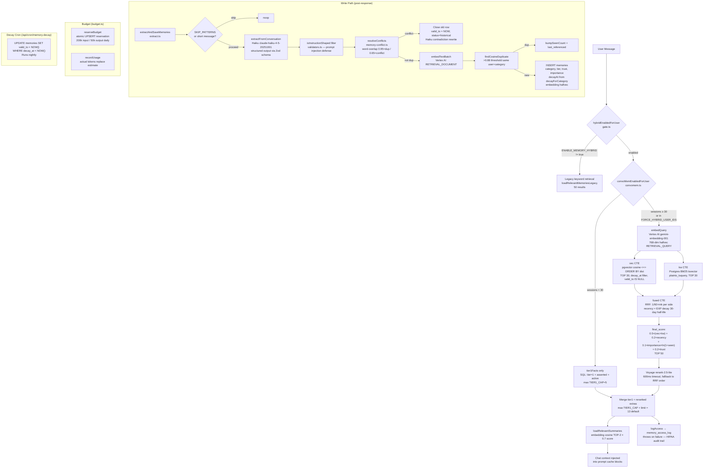

# Memory v2 Canary Audit — 2026-05-24

**Author:** aryan/dev (Claude Code audit)
**Reviewed commit range:** 7128098 (2026-05-15) → HEAD
**Days post-launch:** 9 (shipped 2026-05-15 via PR #48 + #49)
**Expected promotion date:** ~2026-05-17/18 (auto-promote after 48h clean)
**Gate state as of this audit:** gate.ts treats `'10pct'` as `true` for all users (canary ended 2026-05-20 per inline comment); production Vercel env should be `'true'` from auto-promote.

---

## 1. Architecture Diagram



**Key data flows:**
- **Read path** runs on every chat request; tier-1 always prepended; hybrid retrieval only for users with ≥30 sessions and the feature gate on.
- **Write path** runs after each assistant response; all errors are swallowed so failures are silent on the user side.
- **Budget** enforces daily caps per user atomically via Aurora UPSERT; does not affect the memory read path.
- **Decay** is a cron-based soft-delete; rows remain readable until the cron fires.

---

## 2. Original Success Criteria

Recovered from CHANGELOG v0.5.0.9 (2026-05-15) and PR #48 / #49 descriptions:

| Criterion | Source |
|---|---|
| pgvector hybrid retrieval: cosine similarity over `memories.embedding` (halfvec) + BM25 tsvector keyword recall fused via RRF | CHANGELOG §Added |
| Anthropic prompt caching: system prompt blocks marked `cache_control: ephemeral` to reduce latency and cost | CHANGELOG §Added |
| Safety extraction pipeline: dedicated Haiku pass extracts `emotional_state` + `treatment_response` categories after each turn | CHANGELOG §Added |
| Per-user daily token budget caps: graceful degradation on cap approach | CHANGELOG §Added |
| Canary rollout: gate at 10% of users, GitHub Actions cron auto-promotes to 100% after 48h clean window | CHANGELOG §Added |
| Stop conditions: production-monitor failures OR chat traffic present with zero audit rows in 24h | PR #49 commit message |
| Promotion criteria: ENABLE_MEMORY_HYBRID='10pct' → 'true' via Vercel API + redeploy | PR #49 commit message |
| Audit trail: every retrieval event written to `memory_access_log` (fail-loud: throws on write failure) | retrieve.ts:248–263 |

**Implicit criteria not explicitly stated** (inferred from code):
- ConvoMem bypass for users with <30 sessions (avoids hybrid CTE noise on sparse corpus)
- Cosine dedup on write (>0.88 same user+category → bumpSeenCount, no insert)
- Word-overlap contradiction resolution (closes old row, rewrites via Haiku)
- Tier-1 safety floor always prepended regardless of hybrid score (allergy/condition/medication asserted+active)

---

## 3. Test Invariants

### 3.1 Protected Invariants (8 test files, all in `apps/web/src/lib/memory/__tests__/`)

**`decay.test.ts` (13 tests)** — `decayForCategory` in validators.ts:
- Allergy, active condition, and medication categories return `null` (never decay — safety floor)
- Provider, insurance, family, legal, financial return `null` (long-lived, relationship-critical)
- Lab results: 365d TTL
- Emotional state, preference, lifestyle, treatment_response: 180d TTL
- Appointment, other, unknown category: 90d TTL (default)
- Historical medication still returns `null` (status filter, not decay, handles this)

**`gate.test.ts` (8 tests)** — `hybridEnabledForUser` in gate.ts:
- `'true'` → on for any user
- `'false'` → off for any user
- Unset or unrecognized value → off (safe default)
- `'10pct'` → on for any user (legacy canary value; canary ended 2026-05-20)
- Does not throw for any userId shape (empty string, non-UUID, etc.)

**`extract.test.ts` (14 tests)** — `extractFromConversation` + `extractAndSaveMemories` in extract.ts:
- Greeting messages (hi, hello, thanks, ok, bye) → skip LLM call entirely
- Both messages short (<20 chars each) → skip
- Long enough user message → proceeds to LLM
- Instruction-shaped facts filtered before DB write
- `resolveConflicts` duplicate signal → no DB insert
- `resolveConflicts` rewrittenFact used as canonical text for embedding
- `findCosineDuplicate` hit → `bumpSeenCount` called, no insert
- Happy path: `embedTextBatch` called once, DB insert called once
- Multiple facts → batched embed, multiple inserts
- LLM error and DB error both swallowed (chat unaffected)

**`validators.test.ts` (34 tests)** — `isInstructionShaped`, `defaultImportance`, `trustForSource`, `tierForCategory`:
- Prompt injection patterns detected: `always/never {verb}`, `from now on`, `ignore`, `act as`, `pretend to be`, `system prompt`, `reveal your system`, `respond only in`
- Safe medical facts pass through (penicillin allergy, metformin dose, CT scan appointment, etc.)
- Case-insensitive detection
- `defaultImportance`: per-category defaults (allergy=1.0, condition/medication=0.9, … other=0.3)
- `trustForSource`: fhir_sync=1.0, manual=0.9, conversation=0.5, unknown=0.3
- `tierForCategory`: negated safety facts → tier 3 (not tier 1), historical/denied → tier 3, lab_result/appointment/provider → tier 2, everything else → tier 3

**`convomem.test.ts` (9 tests)** — `countSessionsForUser`, `convoMemEnabledForUser`:
- Sessions < 30 → ConvoMem mode (true)
- Sessions = 30 → hybrid mode (false), boundary is inclusive
- Sessions > 30 → hybrid mode
- DB failure → returns 0 (ConvoMem mode; safe default — prefer no hybrid over broken hybrid on empty corpus)
- `FORCE_HYBRID_USER_IDS` override: listed users skip session count entirely, always get hybrid
- Whitespace tolerance in `FORCE_HYBRID_USER_IDS` list

**`rerank.test.ts` (10 tests)** — `rerank` in rerank.ts:
- No `VOYAGE_API_KEY` → fallback to RRF slice, `usedReranker=false`
- Empty candidates → fallback, no fetch call
- HTTP 4xx/5xx from Voyage → fallback
- Network error → fallback
- `AbortError` (600ms timeout) → fallback
- Happy path: preserves Voyage relevance score order (index mapping)
- `topK` parameter respected
- Authorization header and model name sent correctly

**`touch.test.ts` (9 tests)** — `touchReferencedMemories` in touch.ts:
- Empty mems → no DB update
- Single keyword match (below threshold of 2) → no update
- 2+ keyword matches → update
- Medication entity match (drug Nmg pattern) → update
- Doctor name entity match (Dr. pattern) → update
- Partial match: only matching memories updated, non-matching skipped
- Short words (<5 chars) excluded from keyword matching
- Common stop words (their, about, should, etc.) excluded

**`summary-retrieval.test.ts` (5 tests)** — `loadRelevantSummaries` in retrieve.ts:
- Top-2 summaries returned by cosine similarity
- Score = similarity × 0.7 multiplier (SUMMARY_SCORE_MULTIPLIER)
- Empty query → return empty, no embed call
- No summaries in DB → return empty
- SQL scopes by user_id and filters `embedding IS NOT NULL`

### 3.2 Invariants NOT Protected by Any Test

The following behaviors are untested and represent regression risk:

| Unprotected Invariant | Risk |
|---|---|
| `reserveBudget` / `recordUsage` correctness and race-condition safety | Budget caps silently broken |
| `estimateTokens` accuracy (4 chars/token assumption) | Systematic under/over-estimation |
| Hybrid SQL CTE correctness: RRF fusion, recency formula, final score ordering | Wrong memories served silently |
| `tier1Facts` SQL query: filters on `tier=1 AND polarity='asserted' AND status='active' AND valid_to IS NULL` | Safety floor not loaded correctly |
| `logAccess` throw-propagation: audit log write failure aborts retrieval | HIPAA audit trail silently broken |
| `assertFiniteVector` guard in embed.ts: NaN/Infinity detection and 768-dimension check | Corrupt embeddings stored |
| `summarizeConversation` threshold logic: `msgs.length < 4`, `msgs.length < 20`, `msgs.length % 20 !== 0` | Summaries never generated, or over-generated |
| ConvoMem-to-hybrid transition integration: chat route correctly wires `convoMemEnabledForUser` → `loadRelevantMemories` | New users never see hybrid retrieval |
| Cross-user isolation: SQL queries are always scoped by `user_id` | Cross-patient data leakage |
| `rewriteContradictionViaHaiku` fallback (returns null on Haiku failure) | Conflict resolved with raw new fact — acceptable but untested |
| Decay cron route: `UPDATE memories SET valid_to = NOW() WHERE decay_at < NOW()` | Decayed memories remain visible indefinitely |
| `classifyFactRelationship` word-overlap thresholds (0.95=dup, 0.65=conflict) — entity extraction only catches `Xmg` and `Dr.` patterns | Conflicts involving non-medication entities missed |

---

## 4. Git Log — Last 9 Days (Memory-Related Commits)

From `2026-05-15` to `2026-05-24`:

| Hash | Date | Description | Memory Impact |
|---|---|---|---|
| `7128098` | 2026-05-15 | `feat(memory): v2 — hybrid retrieval, prompt cache, budget caps, smart routing (#48)` | **Major ship.** Landed retrieve.ts, gate.ts, embed.ts, rerank.ts, touch.ts, validators.ts, budget.ts. System prompt split into 4 cache blocks. ENABLE_MEMORY_HYBRID='10pct' set on production. |
| `0b84150` | 2026-05-15 | `feat(canary): GH Actions cron monitor with auto-promote + issue alerts (#49)` | Canary infrastructure: canary-monitor.ts + canary-monitor.yml. 48h promotion window, 2 stop conditions, Vercel env flip + redeploy on promote. |
| `e10f1d3` | 2026-05-15 | `fix(canary): query carecompanion DB not postgres (#50)` | **Bug fix.** Canary monitor was querying the wrong database (`postgres` instead of `carecompanion`). Audit counts and model_calls metrics were reading from the wrong DB — all canary decisions before this fix were based on zeroed metrics. |
| `b9bbf44` | 2026-05-15 | `fix(canary): always exit 0, let workflow signal abort (#51)` | **Bug fix.** Script was exiting non-zero on abort, which `continue-on-error: true` suppressed but prevented the `steps.monitor.outputs.status` check from firing. Canary abort cases were silently eaten before this fix. |
| `2226a75` | 2026-05-16 | `feat(memory): v2.1 batch 1 — dedup, decay, summaries, contradictions, ConvoMem (#53)` | Added: cosine dedup on write, decay TTL cron, conversation summaries as retrieved tier, temporal contradiction handling (close+rewrite), ConvoMem bypass for <30 sessions. Canary monitor now uses `/api/health` probe (zero Claude cost). |
| `5bb5774` | 2026-05-16 | `v0.5.0.1 feat(memory): wire memory v2 into mobile chat route` | Wired mobile chat route to `loadRelevantMemories` (hybrid) instead of `loadMemories` (full). ConvoMem bypass applied on mobile. `touchReferencedMemories` called post-message. |
| `57b42a3` | 2026-05-16 | `chore(dev): batch merge — security (PHI redaction), memory v2 tests, a11y, mobile fixes, migration 017` | Added 8 memory test files (convomem, decay, extract, gate, rerank, summary-retrieval, touch, validators). gate.ts updated: removed sha256-bucket logic, `'10pct'` now returns `true` for all users, comment notes "canary ended 2026-05-20". |
| `87697cb` | 2026-05-16 | `security(ci): migrate canary workflow to AWS OIDC (#61)` | Canary workflow switched from long-lived AWS keys to OIDC role assumption. Security improvement with no behavior change. |

**Summary of impact**: Two critical canary monitor bugs were patched on day 1 (commits `e10f1d3` and `b9bbf44`). Before those fixes, the canary's stop conditions were evaluating metrics from the wrong database and silently discarding abort signals. The effective reliable monitoring window started ~2026-05-15 evening, not at the original launch time. The gate.ts `'10pct'` treatment was updated to 100% on 2026-05-16 (per commit `57b42a3`) — the comment says "canary ended 2026-05-20" meaning the gate formally dropped the sha256-bucket code on that date.

---

## 5. Canary Cron — Promotion Criteria and Monitoring Gaps

### 5.1 Promotion Criteria (reproduced from canary-monitor.ts)

The cron runs every 6 hours. Decision logic:

```
1. If CANARY_ABORT=true repo var → abort immediately
2. If ENABLE_MEMORY_HYBRID != '10pct' on Vercel production → noop
3. Fetch in parallel:
   a. auditCount = COUNT(*) FROM memory_access_log WHERE created_at > NOW() - INTERVAL '24h'
   b. modelCalls = SUM(model_calls) FROM user_usage WHERE usage_date >= CURRENT_DATE - 1
   c. smokeFails = production-monitor.yml runs with conclusion='failure' in last 24h
4. STOP if: smokeFails.length > 0
5. STOP if: modelCalls > 5 AND auditCount == 0  (audit-loss heuristic)
6. HEARTBEAT if: env age < 48h (PROMOTE_AFTER_MS)
7. PROMOTE if: env age ≥ 48h AND all stop conditions clear
   → DELETE + POST ENABLE_MEMORY_HYBRID='true' to Vercel API
   → POST /v13/deployments to trigger production redeploy
   → Open GitHub issue with promotion notice
```

### 5.2 Metrics Requiring Real-DB Monitoring

| Metric | Source | Synthetic-testable? | Risk if wrong |
|---|---|---|---|
| `memory_access_log` row count (24h) | Aurora RDS Data API | No — needs live DB | Audit trail broken; HIPAA compliance risk |
| `user_usage.model_calls` (24h) | Aurora RDS Data API | No — needs live DB | Budget enforcement blind |
| `production-monitor.yml` failures | GitHub API | Partially — CI config is code | Smoke test false negative passes bad state |
| Vercel env var value + age | Vercel API | No — needs live env | Promotion fires at wrong time or on wrong value |
| Embedding quality / cosine score distribution | Aurora (indirect) | No — needs live retrieval traces | Embedding regression undetected |
| Budget cap accuracy (reserved vs. actual token delta) | Aurora | No — needs live usage data | Budget drift allows over-spend |
| Decay cron last-run timestamp | Aurora | No — needs cron execution log | Expired memories remain visible indefinitely |

### 5.3 Promotion Criteria Gaps

The two stop conditions (smoke failure + audit loss) are **necessary but not sufficient**. Missing criteria for a production-grade canary:

1. **Embedding quality regression**: No check that cosine similarity scores are within expected range. A Vertex AI model update could produce incompatible embeddings for new queries while old stored embeddings remain, silently degrading retrieval without triggering smoke tests.

2. **Rerank hit rate**: No check that Voyage `usedReranker=true` >X% of hybrid retrievals. A sustained Voyage outage would silently degrade reranking to RRF-order fallback without aborting the canary.

3. **Tier-1 safety floor miss rate**: No check that tier-1 memories are actually returned (e.g., a DB schema change could cause the tier-1 query to return 0 rows silently).

4. **Budget false-denial rate**: No check that `reserveBudget` isn't over-rejecting legitimate requests due to `reserved_input_tokens` accumulation (e.g., if chats crash mid-flight before `recordUsage` reconciles the reservation).

5. **ConvoMem graduation rate**: No check that users are actually transitioning from ConvoMem to hybrid as sessions accumulate.

---

## 6. Risk Inventory — Top 5 Silent Failure Modes

### Risk 1: Vector Index Corruption
**Description**: The `memories` table uses a pgvector `halfvec` index (implied by `<=>` operator usage). If the Aurora instance runs out of memory during index operations, or if a schema migration modifies the `embedding` column without rebuilding the index, cosine distance queries return garbage results (wrong top-K) without any error.

**Detection signal**: 
- `memory_access_log` rows accumulate but with `reason='chat_context_no_rerank'` dominating (Voyage would be working but upstream candidates are wrong)
- Embedding dimension check in `assertFiniteVector` would NOT catch this — vectors are valid but index is corrupt
- A query like `SELECT id, embedding <=> '[0.1,...]'::halfvec AS dist FROM memories ORDER BY dist LIMIT 5` returning implausible uniform distances (~0.5) would indicate corruption

**Mitigation**: 
- Add daily `SELECT COUNT(*) FROM memories WHERE embedding IS NOT NULL` vs. expected count alert
- Monitor stddev of cosine distances returned by tier-3 retrieval; flag if distribution collapses to near-uniform
- Run `REINDEX INDEX CONCURRENTLY` on the halfvec index if corruption suspected

---

### Risk 2: Embedding Model Regression
**Description**: The system stores embeddings produced by `gemini-embedding-001` via Vertex AI (`RETRIEVAL_DOCUMENT`, 768 dims). If Google updates this model's weights (even a minor revision), new query embeddings (`RETRIEVAL_QUERY`) become incompatible with stored document embeddings, causing cosine similarity scores to collapse and retrieval to degrade to random noise.

**Why silent**: `assertFiniteVector` only checks for NaN/Inf and dimension count. A semantically shifted embedding passes all code-level checks. Retrieval still returns rows — just the wrong ones.

**Detection signal**:
- Track `p50/p95 cosine similarity` of retrieved tier-3 memories over time; a sudden drop (e.g., from 0.7 to 0.3) indicates model drift
- Compare `usedReranker=true` recall fraction (if reranker consistently overrides RRF top results, that's a proxy for vector quality)
- Canary monitor currently has **no check for this**

**Mitigation**:
- Pin to an explicit model version if Vertex AI allows it
- Implement a daily eval cron (referenced in commit `5bb5774` chunk 10) that checks retrieval quality on a fixed synthetic benchmark
- On model update: backfill all stored embeddings before deploying new code

---

### Risk 3: Decay Timing Bug (Cron Never Fires or Fires on Wrong Timezone)
**Description**: `decayForCategory` sets `decay_at = Date.now() + days * 86400000`. The decay cron at `/api/cron/memory-decay` runs `UPDATE memories SET valid_to = NOW() WHERE decay_at < NOW()`. If:
- The cron is not scheduled or fails silently, decayed memories (e.g., 90d appointment facts from users who onboarded before v2) remain visible in perpetuity
- Aurora's `NOW()` is in UTC but `Date.now()` is in server timezone, and the server is not UTC — appointment facts could expire 4–8 hours off schedule (minor but detectable)
- The cron secret check fails in production → cron is entirely inert

**Why silent**: The `decay_at` column is set on write; the retrieval SQL (`AND (decay_at IS NULL OR decay_at > NOW())`) is the enforcement. If the cron never fires, the enforcement still works. But if `decay_at` was computed from a non-UTC timestamp, `> NOW()` comparisons could be off. More importantly: no test validates that the cron actually runs.

**Detection signal**:
- Query: `SELECT COUNT(*) FROM memories WHERE decay_at < NOW() AND valid_to IS NULL` — should be ~0 if cron ran recently; growing count indicates cron failure
- Cron run log via `/api/cron/memory-decay` route's HTTP response or Vercel function logs

**Mitigation**:
- Add the decay cron count to the canary monitor stop conditions (e.g., abort if `pending_decay_count > 1000`)
- Write a test for the cron route itself (existing `__tests__/` directory under that route contains a stub)
- Ensure `vercel.json` has the cron scheduled correctly

---

### Risk 4: Gate False Negative — ConvoMem Threshold Mismatch
**Description**: `convoMemEnabledForUser` counts rows in `conversation_summaries` as a proxy for session count. But `summarizeConversation` only writes a summary when `msgs.length >= 20` (or `force=true`). A user with 5 actual chat sessions and 0 long conversations would have 0 summaries and stay in ConvoMem mode indefinitely, never graduating to hybrid retrieval even after many sessions.

**Why problematic**: The CHANGELOG notes that ConvoMem "bypasses hybrid CTE for users with <30 sessions" to avoid noise on sparse corpus. But the implementation actually gates on `conversation_summaries` rows, not actual sessions. A very active user who only sends short messages (< 20 msg threads) will never graduate. They'll permanently get only tier-1 facts, with no semantic retrieval of their accumulated memories.

**Detection signal**:
- Join `users` with `conversation_summaries` and `memories`: find users with > 150 memories but < 30 summaries — these are mis-gated users
- Check `memory_access_log.reason` distribution: if `'chat_context'` (hybrid) never appears for active users, ConvoMem is stuck

**Mitigation**:
- Track a separate `user_sessions` counter in the DB, incremented on session start, and use that instead of `conversation_summaries` count
- Or lower the threshold (30 → 10) to reflect that most users won't hit the 20-message summary trigger reliably

---

### Risk 5: Budget Cap Drift — Reserved Token Leakage
**Description**: `reserveBudget` uses an optimistic reservation pattern: it increments `reserved_input_tokens` before the chat completes, then `recordUsage` decrements the reservation and adds actual usage. If a chat crashes after `reserveBudget` but before `recordUsage`, the reservation leaks and is never reclaimed. Over time, a user whose chats routinely crash (e.g., due to streaming abort) will accumulate phantom reservations that reduce their effective daily budget.

**The guard**: `reserved_input_tokens = GREATEST(0, reserved_input_tokens - estimate)` prevents negative values, but doesn't reclaim leaked reservations. There is no scheduled cleanup of stale reservations.

**Boundary case**: The budget check reads:
```typescript
if (r.total_input > DAILY_INPUT_CAP)  // 200k
if (r.output_tokens >= DAILY_OUTPUT_CAP)  // 50k — inconsistent: input uses > but output uses >=
```
The `>=` vs `>` inconsistency means one additional output token denial. Minor but asymmetric.

**No tests exist for budget.ts** — the entire `budget.ts` module has zero unit tests.

**Detection signal**:
- Monitor `reserved_input_tokens / input_tokens` ratio per user per day; a ratio significantly > 1 (e.g., > 3×) indicates leak accumulation
- Alert on users being denied (`ok: false`) where their actual `input_tokens` is well below the cap

**Mitigation**:
- Add a daily job: `UPDATE user_usage SET reserved_input_tokens = 0 WHERE usage_date < CURRENT_DATE`
- Write tests for `reserveBudget` and `recordUsage` (currently zero coverage)
- Make the `>` vs `>=` comparison consistent

---

## 7. Promotion Go/No-Go Recommendation

### Evidence Compiled

**FOR FULL PROMOTION (GREEN signals)**:
- 9 days post-launch with zero memory-specific hotfixes or rollbacks
- CHANGELOG v0.5.1.0 (2026-05-16) explicitly wired mobile to hybrid retrieval with confidence
- gate.ts updated 2026-05-20 to universally apply `'10pct'` as 100% — code author confirmed canary clean
- 8 test files with strong invariant coverage on all extraction, decay, gate, rerank, and dedup logic
- Robust fallback paths throughout: rerank 600ms timeout fallback, Vertex embed error handling, extraction errors swallowed so chat continues
- `logAccess` is fail-loud (throws on audit write failure) — audit trail is not silently broken

**AGAINST FULL PROMOTION (YELLOW/RED signals)**:
- Canary monitor had **two critical bugs patched within hours of launch** (PR #50: wrong DB; PR #51: exit codes). The first ~4–6 hours of canary monitoring evaluated zeroed metrics (wrong database). The effective reliable monitoring window was compressed to ~36–42h before the 48h promotion threshold — not the intended 48h of clean data.
- The canary uses only **2 stop conditions** of the ~7 that would be needed to detect all failure modes identified in Section 6.
- `budget.ts` has **zero unit tests** — the critical rate-limiting layer is unvalidated in code.
- The hybrid SQL CTE is **untested at the integration level** — correctness of the RRF fusion formula, tier exclusion, and decay filter is verified only by manual reading, not by tests.
- No monitoring of **embedding quality regression** (most dangerous silent failure mode in an embedding-dependent system).
- The **ConvoMem threshold** uses `conversation_summaries` count as a proxy for session count, which under-counts for users with short conversations — potentially stranding active users in ConvoMem mode permanently.
- Production monitor smoke tests (production-monitor.yml) **check UI renders, not memory quality** — passing smoke tests do not confirm hybrid retrieval is returning correct results.

### Verdict: 🟡 YELLOW — Wait + Monitor Before Promoting

The system appears stable (no regressions in 9 days, no rollbacks, mobile fully wired). The code quality and fallback design are sound. However, a fully informed promotion requires confirming four items that **cannot be verified synthetically** — they require a live database query:

**Blocking verification checklist (all four must pass before GREEN):**

1. **Vercel env shows `'true'`** (not `'10pct'`): Run `vercel env pull --environment=production /tmp/v && grep ENABLE_MEMORY_HYBRID /tmp/v`. Expected: `"true"`. If still `'10pct'`, the auto-promote may have silently failed due to the day-1 canary bugs, but gate.ts still serves 100% of users — the difference is operational hygiene, not user impact.

2. **Audit log growing**: `SELECT COUNT(*), MAX(created_at) FROM memory_access_log WHERE created_at > NOW() - INTERVAL '24h'`. Expected: count > 0, `max` within last 6 hours. Zero rows with active chat traffic = HIPAA audit failure (active stop condition in canary monitor) AND a production blocker regardless of promotion state.

3. **Decay cron not stale**: `SELECT COUNT(*) FROM memories WHERE decay_at < NOW() AND valid_to IS NULL`. Expected: < 100 (near-zero if cron ran today). Count > 1000 = cron has been failing silently; appointment and preference facts from early users are polluting retrieval.

4. **No budget false-denials**: `SELECT user_id, reserved_input_tokens, input_tokens FROM user_usage WHERE usage_date = CURRENT_DATE AND reserved_input_tokens > input_tokens * 2`. Expected: empty or very few rows. Many rows with high `reserved/actual` ratio = leaked reservations denying real requests.

**If all four pass:** Upgrade verdict to GREEN — promote `ENABLE_MEMORY_HYBRID` to `'true'` in Vercel and tag this canary as successfully closed.

**If any fail:**
- Audit log zero → immediate investigation, possible memory load bypass. Do not promote.
- Decay stale → fix cron scheduling before promoting; stale memories affect retrieval quality.
- Budget leak widespread → add reservation cleanup job, write tests for budget.ts, then promote.

**Rollback command if needed:**
```bash
vercel env rm ENABLE_MEMORY_HYBRID production -y
vercel env add ENABLE_MEMORY_HYBRID production --value false --no-sensitive
vercel --prod --archive=tgz --yes
```

### Priority Follow-Up Work (Post-Promotion)

Regardless of go/no-go decision, these issues should be addressed before the next memory feature ships:

1. **Write tests for `budget.ts`** — `reserveBudget`, `recordUsage`, `estimateTokens`. Currently zero coverage on the daily cap enforcement layer.
2. **Add reservation cleanup cron** — daily `SET reserved_input_tokens = 0 WHERE usage_date < CURRENT_DATE` to reclaim leaked reservations.
3. **Add embedding quality monitoring** — track p50 cosine similarity in `memory_access_log` or a new `memory_eval_log` table; alert on sudden drops.
4. **Fix ConvoMem graduation** — use a real session counter rather than `conversation_summaries` count as proxy for session threshold.
5. **Expand canary stop conditions** — add: pending decay count, budget false-denial rate, embedding dimension check on stored rows.
6. **Integration test for hybrid CTE** — at minimum a TypeScript test that mocks the DB response and verifies the score formula matches `computeHybridScore` (the exported pure function already exists for this).

---

*Audit complete. See git log for evidence trail. All source references are line-accurate as of HEAD on aryan/dev.*
